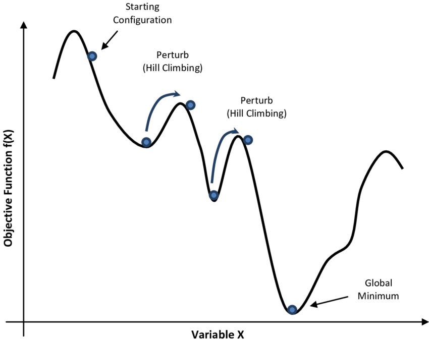
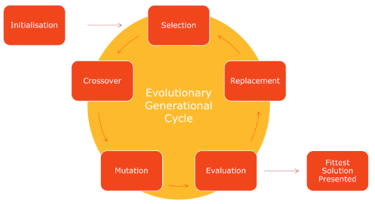
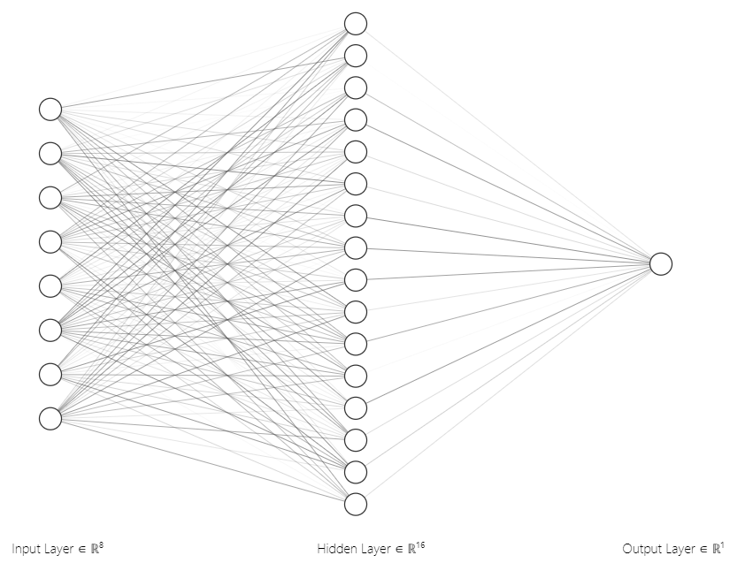
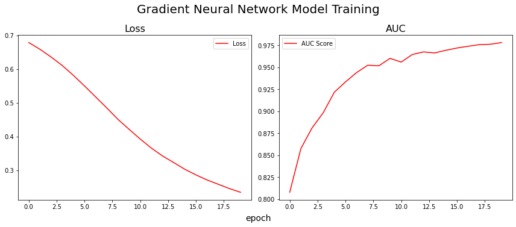
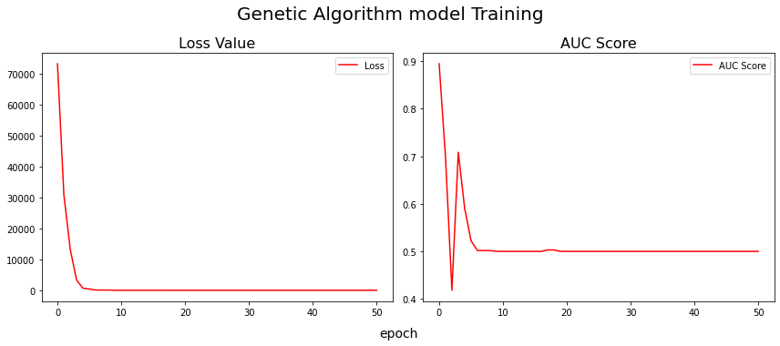
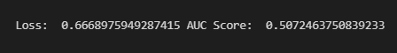
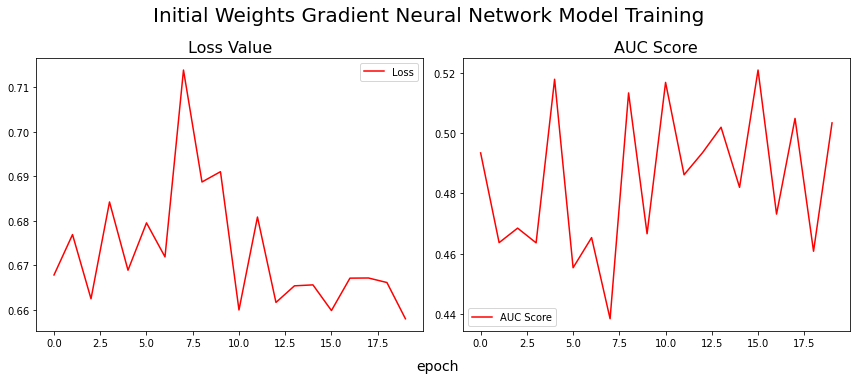
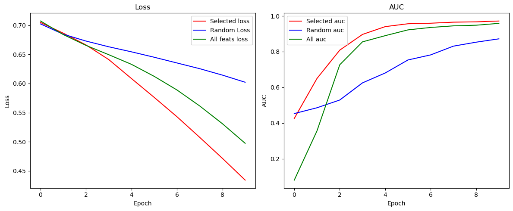

# Alternative Optimization Methods for Neural Networks

This repository contains the code, report, and results for a research project exploring **alternative optimization methods for neural network training**. The project investigates the effectiveness of gradient-free optimization techniques—specifically, **Genetic Algorithms (GA)** and **Simulated Annealing (SA)**—and compares them to traditional **Gradient Descent (GD)**.

## Project Structure

- **`main.ipynb`**: Jupyter notebook containing all code, experiments, and visualizations.
- **`main.tex`**: LaTeX source for the project report, including detailed explanations and results.
- **`images/`**: Folder containing all figures and result images used in the report and notebook.
- **`report.pdf`**: Compiled version of the project report.
- **`presentation.pptx`**: Project presentation slides.

## Summary

This project evaluates the efficiency of various optimization methods for neural network training, focusing on situations where gradient-based methods may struggle (e.g., local optima, non-differentiable functions, high-dimensional search spaces). The methods explored are:

- **Gradient Descent (GD)**
- **Simulated Annealing (SA)**
- **Genetic Algorithm (GA)**

The experiments use the breast cancer dataset from scikit-learn as a benchmark. The project also explores combining these methods for feature selection and weight initialization.

## Methods Overview

### Gradient Descent

Gradient Descent is a widely used optimization algorithm for training neural networks by iteratively updating parameters to minimize the loss function.

### Simulated Annealing

Simulated Annealing is a probabilistic technique inspired by metallurgy, useful for escaping local optima by occasionally accepting worse solutions. It is also used for feature selection in this project.

### Genetic Algorithm

Genetic Algorithms mimic natural selection, evolving a population of candidate solutions through selection, crossover, and mutation. In this project, GA is used for both training and weight initialization.

## Neural Network Architecture

A simple feedforward neural network is used as the base model for all experiments.

## Experimental Evaluation & Results

### Training with Gradient Descent

Gradient descent effectively optimizes the neural network, achieving a significant reduction in loss.

### Training with Genetic Algorithm

The genetic algorithm can decrease the loss, but not as efficiently as gradient descent, especially for high-dimensional neural networks. Time complexity is also higher.

### Genetic Algorithm for Weight Initialization

Using GA to initialize weights before training with gradient descent can help, but the model may still get stuck in local minima.

### Simulated Annealing for Feature Selection

Simulated annealing is used to select the most relevant features, improving model performance and reducing overfitting. The results show that simulated annealing performs slightly better than random feature selection and is comparable to using all features.

## Conclusion

- Gradient-free methods (GA, SA) are more effective for small search spaces or non-differentiable problems.
- For high-dimensional neural networks, gradient descent remains more efficient and reliable.
- Gradient-free methods are valuable for hyperparameter search and feature selection.
- Combining these methods (e.g., using GA for weight initialization and SA for feature selection) can be beneficial, but may not always outperform gradient-based methods for large-scale problems.

## How to Use

1. Clone the repository.
2. Open `main.ipynb` in Jupyter Notebook or JupyterLab.
3. Run the cells to reproduce the experiments and visualizations.
4. See `main.tex` or `report.pdf` for the full report and discussion.

## Authors
- Abdullah Bilici
- Eren Oluğ
- Salim Beyden

## License
This project is for academic and research purposes.
